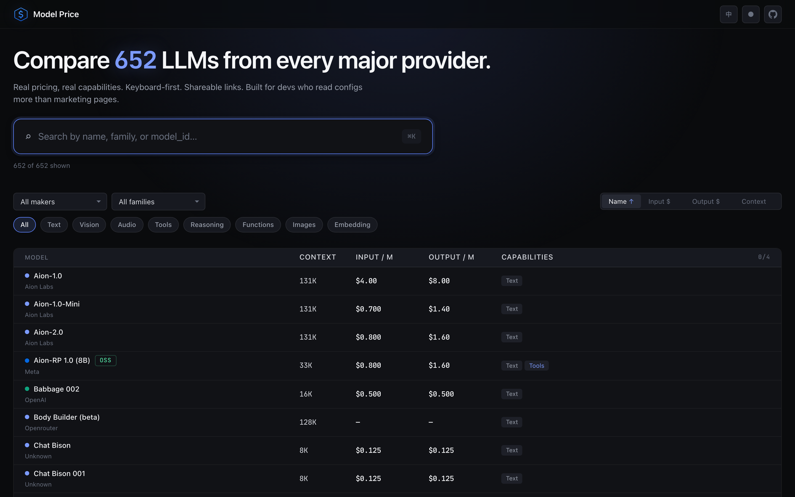
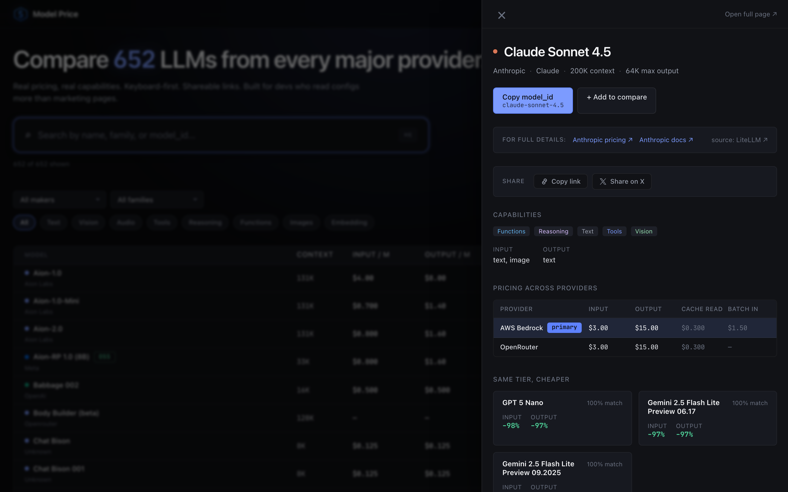
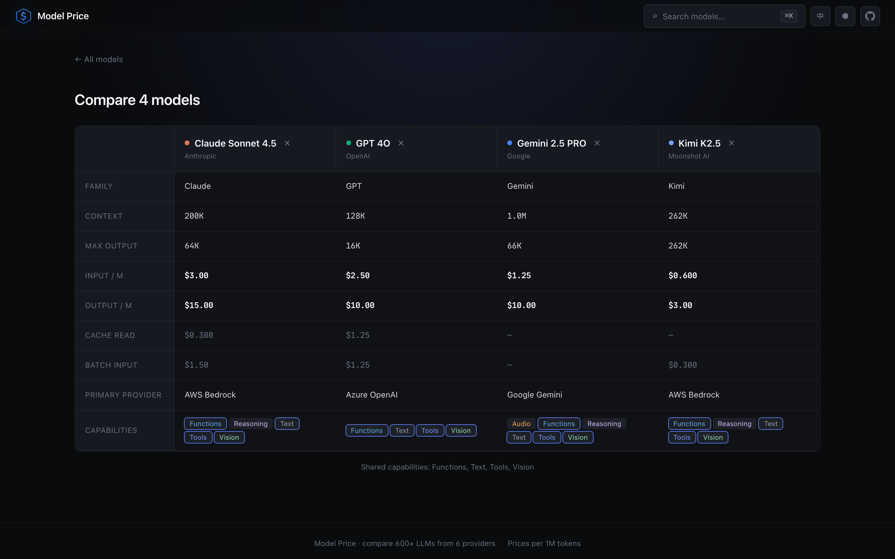
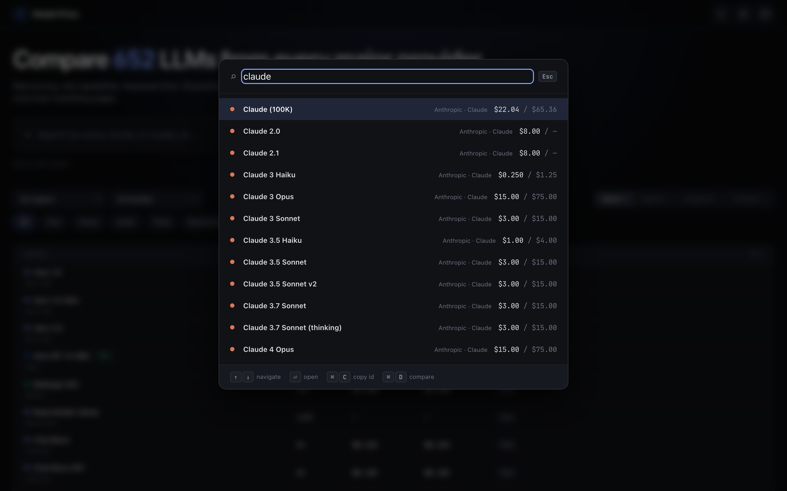
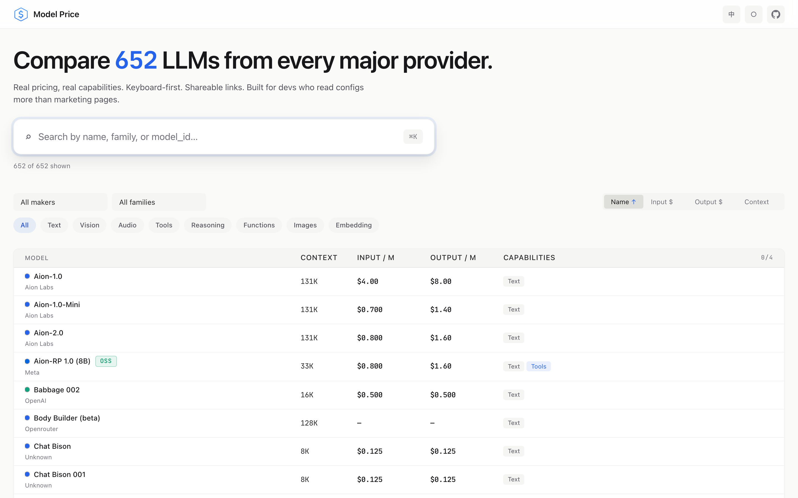
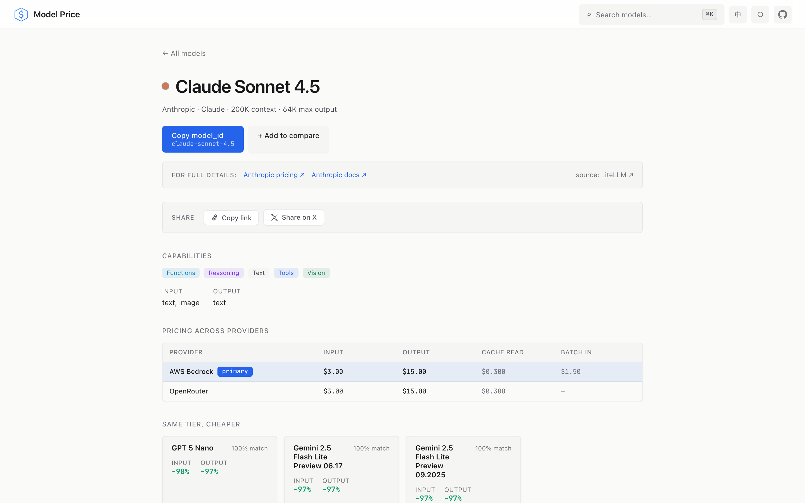

<div align="center">


# Model Price

**Compare 650+ LLMs side by side — real pricing, real capabilities.**

[modelprice.closeai.space](https://modelprice.closeai.space) · built for devs who read configs more than marketing pages

[](https://www.python.org/)
[](https://fastapi.tiangolo.com/)
[](https://react.dev/)
[](https://www.typescriptlang.org/)
[](#testing)
[](LICENSE)

[English](README.md) · [简体中文](README_CN.md)

</div>



---

## Why

Every LLM vendor publishes their own pricing table in their own format, with their own units, their own cache semantics, and their own marketing copy. The moment you try to answer *"should I use Sonnet 4.5 or DeepSeek V3 for this feature"* you end up with six open tabs and a spreadsheet.

Model Price collapses that into **one keyboard-first page** that:

- Knows about **650+ models** across Anthropic, OpenAI, Google, xAI, Meta, DeepSeek, Moonshot AI, Alibaba, Z.AI, MiniMax, Mistral, Cohere and 40+ other labs
- Normalizes everything to **per 1M tokens** so side-by-side numbers are actually comparable
- Sources data from the community-maintained **LiteLLM registry** + direct provider scrapes; refresh it manually when needed, without a long-running backend service
- Deduplicates across providers: *"Claude Sonnet 4.5"* is **one** entity with multiple offerings (Anthropic / Bedrock / OpenRouter), not three confusing rows
- Is **shareable**: every model has `/m/:slug`, every comparison has `/compare/:ids`, both are proper URLs you can paste in a tweet

## Screens

### Home — browse and filter 650+ models


### Drawer — zero-click-away detail with same-tier alternatives



### Compare — up to 4 models side by side, shared capabilities highlighted



### ⌘K command palette — client-side fuzzy search, zero network



### Light theme — warm off-white, not institutional gray

<table>
<tr>
<td></td>
<td></td>
</tr>
</table>

## Highlights

- **Keyboard first** — `⌘K` opens a fuzzy search palette, `↑↓` to navigate, `Enter` to open, `⌘C` to copy the `model_id`, `⌘D` to add to compare. Runs entirely client-side.
- **Static by default** — every visit renders directly from the bundled `v2-fallback.json` snapshot; browsing, search, detail pages, and comparisons do not need a backend service.
- **"Same tier, cheaper" recommendations** — every detail view surfaces 3 alternatives ranked by `capability_overlap × savings` (Jaccard over capability sets, weighted by input-price delta). The algorithm lives in `backend/services/alternatives.py` and is mirrored in the build-time fallback generator.
- **Drift report** — every refresh emits a `drift.json` listing unmatched provider models, price deltas > 5%, new/removed entities. Self-healing data quality.
- **Official source links** — every detail page links out to the maker's official pricing and docs. We provide the index, vendors provide the truth.
- **Dark / light / system** theme, **EN / 中文** localization, both persist to localStorage.
- **Open Graph + Twitter Card** meta tags with a custom OG image — shareable on X, Slack, WeChat (copy link), Discord, Feishu with a real preview card.

## How it works

```
         ┌────────────────────────────────────────────────┐
         │  LiteLLM registry                              │
         │  github.com/BerriAI/litellm  (single SoT)      │
         └────────────────┬───────────────────────────────┘
                          │  fetched raw JSON on every refresh
                          ▼
         ┌────────────────────────────────────────────────┐
         │  Canonical Entity Layer                        │
         │  slug, family, maker, context, capabilities,   │
         │  modalities, primary_offering_provider         │
         └────────────────┬───────────────────────────────┘
                          │  provider aliases via reverse index
                          ▼
  ┌──────────┬──────────┬──────────┬──────────┬──────────┬──────────┐
  │ Anthropic│ Bedrock  │  Azure   │  OpenAI  │OpenRouter│ xAI/etc. │
  │  fetch() │  fetch() │  fetch() │  fetch() │  fetch() │  fetch() │
  └────┬─────┴────┬─────┴────┬─────┴────┬─────┴────┬─────┴────┬─────┘
       └──────────┴──────────┴────┬─────┴──────────┴──────────┘
                                  ▼
                  ┌──────────────────────────────────┐
                  │  Offering Merger                 │
                  │  Each provider record resolves   │
                  │  to a canonical_id via strict    │
                  │  slug+prefix+version stripping   │
                  └──────────────┬───────────────────┘
                                 ▼
                  ┌──────────────────────────────────┐
                  │  entities.json + offerings.json  │
                  │  + drift.json (data quality)     │
                  └──────────────┬───────────────────┘
                                 ▼
                  ┌──────────────────────────────────┐
                  │  v2-fallback.json snapshot       │
                  │  shipped inside the static app   │
                  └──────────────────────────────────┘
```

Two-layer data model: **Entity** (logical model like `claude-sonnet-4-5`) + **Offering** (one specific `(entity, provider)` pair with its own price and last-updated timestamp). One canonical `claude-sonnet-4-5` entity with three offerings (Anthropic, Bedrock, OpenRouter) — not three separate rows with the same name.

## Stack

| Layer | Tech |
|-------|------|
| **Data generation** | Python 3.12, Pydantic v2, httpx, Playwright (for provider scrapes), pytest; FastAPI remains available as a development/debug tool |
| **Frontend** | React 19, TypeScript 5.9, Vite 7, React Router 7, vitest + @testing-library/react + happy-dom |
| **Data** | LiteLLM `model_prices_and_context_window.json` + direct provider APIs / scrapes, merged into entity/offering JSON files, shipped as a static snapshot alongside the SPA |
| **Hosting** | Vercel static frontend, auto-deploy on `release` push |

## Local development

### Update pricing snapshot

```bash
./scripts/update-prices.sh
```

This re-fetches LiteLLM and provider pricing, writes `backend/data/v2/entities.json` / `offerings.json` / `drift.json`, then regenerates `frontend/public/v2-fallback.json`.

### Frontend

```bash
cd frontend
npm install

npm run dev                           # http://localhost:5173
npm test                              # 32 frontend tests
npm run build                         # prod bundle into dist/
```

The frontend reads only `frontend/public/v2-fallback.json`. Use `VITE_PUBLIC_BASE_URL` to override the canonical public origin used by Copy Link / Share on X (defaults to `https://modelprice.closeai.space`).

### Sanity check

```bash
cd backend
uv run --active python scripts/sanity_check.py
```

Prints a hit-rate matrix of ~80 popular first-party models against the v2 entity set. Currently at **79%** — the misses are long-tail edge cases logged in `drift.json`.

### Regenerate the OG cover

```bash
cd backend
uv run --active python scripts/generate_og_cover.py
```

Writes `frontend/public/og-cover.png` (1200×630). Regenerate after copy or palette changes.

### Take README screenshots

```bash
cd backend
uv run --active python scripts/take_screenshots.py
```

Uses the Playwright Chromium to capture the production site into `docs/screenshots/` — home / drawer / entity page / compare / ⌘K palette in both dark and light themes.

## Testing

**168 tests total**, all hermetic, ~3 seconds to run the whole suite:

- **Data generation (pytest, 136)** — `slugify` / `strip_version_suffix`, family-detection ordering (guards the "Codex before GPT" and "Cogito before Llama" regressions), canonical resolver cascade, offering merger helpers, `compute_alternatives` ranking math, `/api/v2/*` contract tests via FastAPI `TestClient`.
- **Frontend (vitest + @testing-library/react + happy-dom, 32)** — `formatPrice` / `formatContext` / `formatPct`, `CompareBasketProvider` (capacity cap, sessionStorage persistence, provider-scoping error), `ThemeProvider` (dark/light/system cycle, `matchMedia` listener, `<html data-theme>` reflection), `LocaleProvider` (default EN, `{name}` interpolation, `<html lang>` sync).

Run them:

```bash
cd backend && uv run pytest
cd frontend && npm test
```

## Deployment

The `release` branch is the production branch.

- **Vercel** auto-builds and deploys the frontend on every `release` push. Config lives in `frontend/vercel.json` and has a catch-all rewrite to `index.html` so React Router deep links work.
- Production no longer needs Render or a keepalive cron. Price updates are generated manually with `./scripts/update-prices.sh` and shipped as a static snapshot with the frontend.

Previous v1 production is tagged `release-v1-backup` for rollback. The v1 routes (`/api/models`, `/api/providers`, `/api/families`, `/api/stats`, `/api/refresh/metadata`) were removed on 2026-04-15.

## Design notes & philosophy

Read the v2 rebuild design document at [`docs/plans/2026-04-14-v2-redesign-design.md`](docs/plans/2026-04-14-v2-redesign-design.md) — it documents the product positioning (D quick lookup + A comparison as foundation, C "same-tier cheaper" as killer differentiator), the target audience (independent developers + agent/toolchain devs), the single-point breakthrough (Cmd+K + shareable URLs), the two-layer data model, the cold-start strategy, and every non-goal we intentionally didn't ship.

The v2 API contract is frozen at [`docs/plans/v2-api-contract.md`](docs/plans/v2-api-contract.md).

## License

MIT — see [LICENSE](LICENSE).

Data sourced from [BerriAI/litellm](https://github.com/BerriAI/litellm) (MIT). Thanks to the LiteLLM community for maintaining the registry that makes this site possible.
