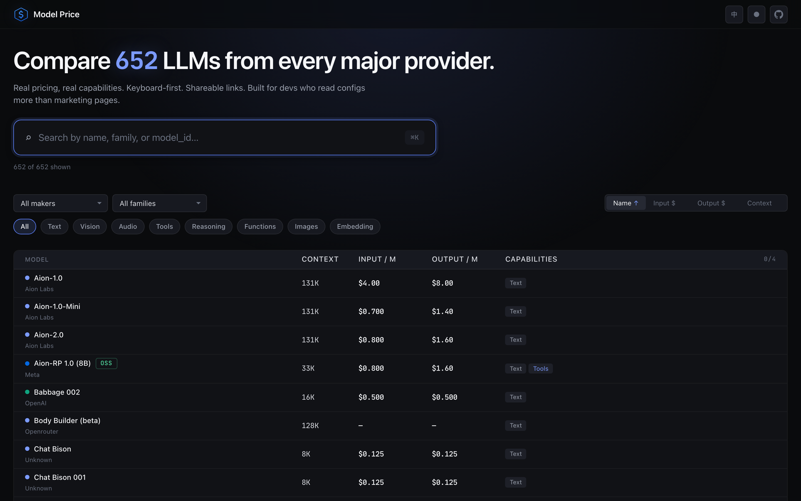
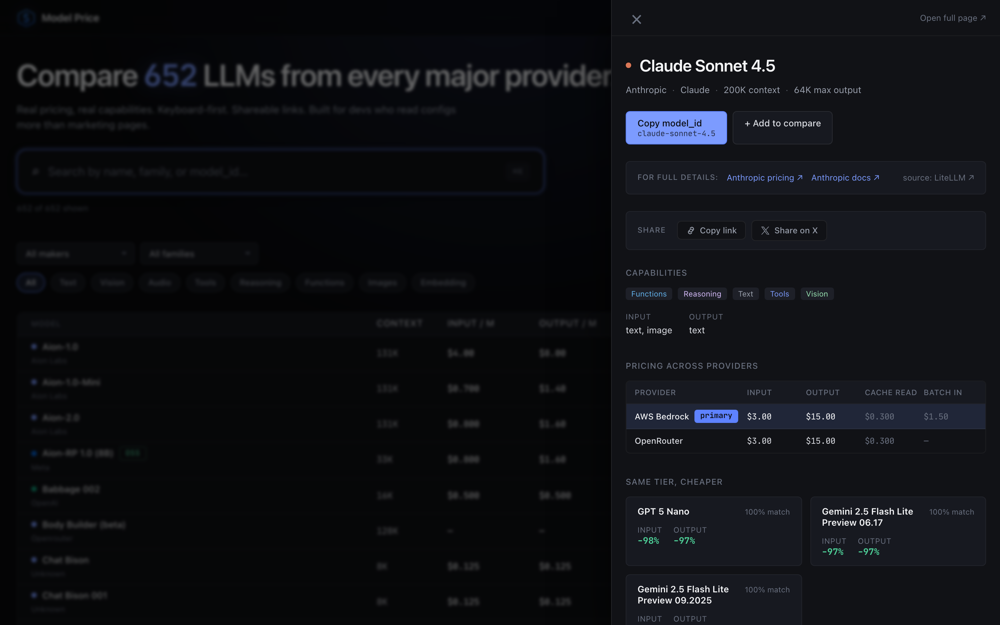
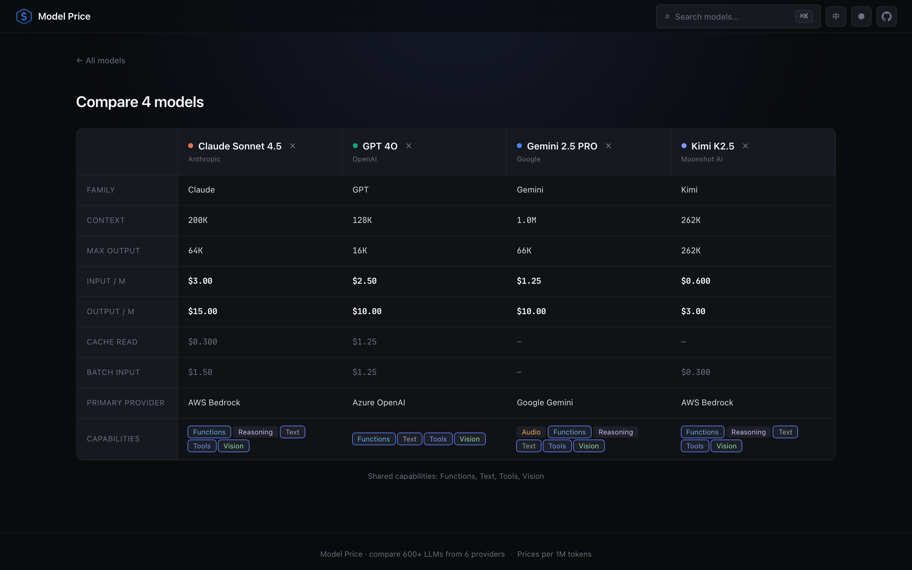
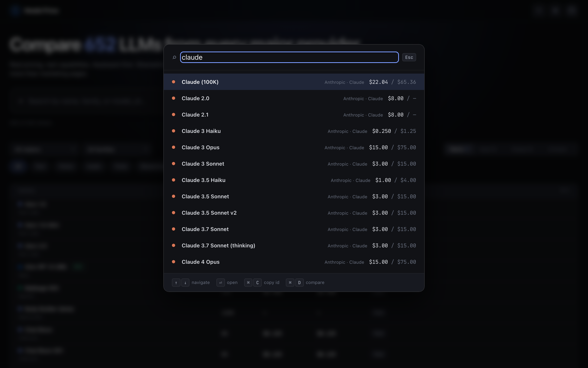
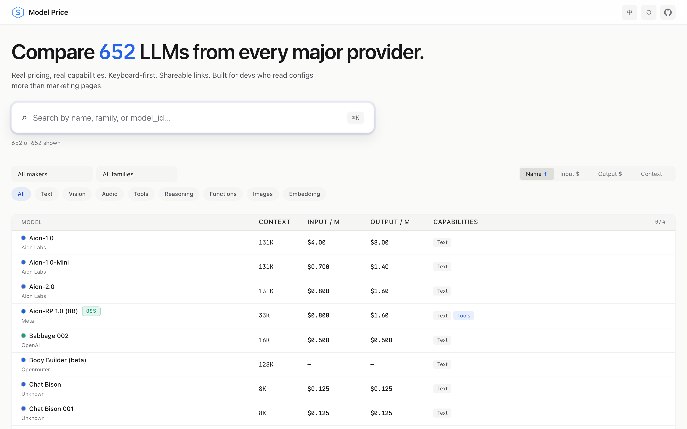
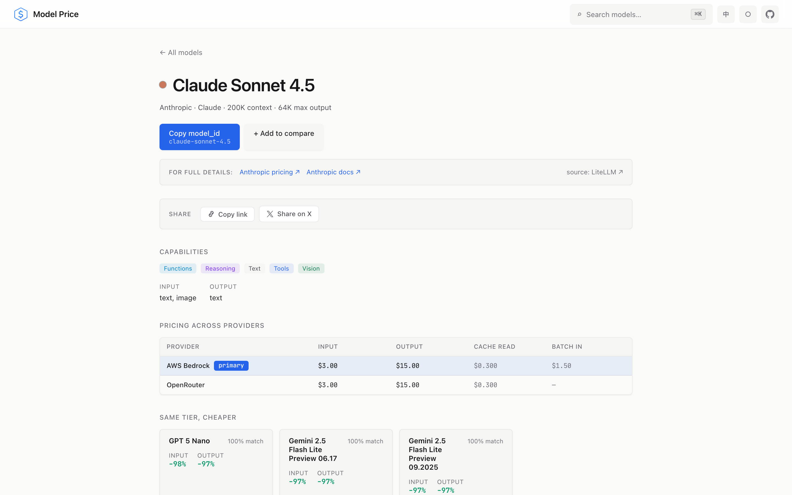

<div align="center">


# Model Price

**并排对比 650+ 大模型 — 真实价格，真实能力。**

[modelprice.boxtech.icu](https://modelprice.boxtech.icu) · 为每天读 config 多过读官网的开发者打造

[](https://www.python.org/)
[](https://fastapi.tiangolo.com/)
[](https://react.dev/)
[](https://www.typescriptlang.org/)
[](#测试)
[](LICENSE)

[English](README.md) · [简体中文](README_CN.md)

</div>



---

## 为什么做这个

每家 LLM 厂商都用自己的格式、自己的单位、自己的 cache 语义、自己的营销话术发布价格。想回答"这个功能用 Sonnet 4.5 还是 DeepSeek V3 更好"——结果打开六个 tab 配一张 Excel。

Model Price 把这件事收敛到 **一个键盘优先的页面**，它：

- 收录 **650+ 个模型**，覆盖 Anthropic、OpenAI、Google、xAI、Meta、DeepSeek、Moonshot AI、阿里云、Z.AI、MiniMax、Mistral、Cohere 以及其他 40+ 家厂商
- 所有价格统一换算到 **每 100 万 token**，横向数字可以直接对比
- 数据源自社区维护的 **LiteLLM 注册表** + 各 provider 直接抓取——新模型发布后几天内自动入库，不需要人工维护
- **跨 provider 去重**：同一个 "Claude Sonnet 4.5" 是**一个** entity + 多个 offering（Anthropic / Bedrock / OpenRouter），而不是三行重复
- **可分享**：每个模型都有 `/m/:slug`，每次对比都有 `/compare/:ids`，都是干净 URL，粘到推特或微信都能打开

## 界面

### 首页 — 浏览、筛选 650+ 模型


### Drawer — 零点击即可看到详情 + 同档更便宜的替代品



### 对比页 — 最多 4 个模型并排，共同能力高亮



### ⌘K 命令面板 — 纯客户端模糊搜索，零网络



### 亮色主题 — 温暖的 off-white，不是机关单位灰

<table>
<tr>
<td></td>
<td></td>
</tr>
</table>

## 亮点

- **键盘优先** — `⌘K` 打开模糊搜索面板，`↑↓` 导航、`Enter` 进入、`⌘C` 复制 `model_id`、`⌘D` 加入对比。全部客户端运行。
- **抗冷启动** — 每次访问都从 bundled `v2-fallback.json` snapshot (≈90 KB gzip) 立即渲染；后台静默 fetch 真实 `/api/v2/*`，Render 醒来后数据静默切换。哪怕 Render free 计划冷启动，用户也看不到白屏。
- **"同档更便宜"推荐** — 每个详情页自动列出 3 个替代品，按 `能力重叠 × 价格节省` 打分（Jaccard over capability sets + input 价差加权）。算法在 `backend/services/alternatives.py`，构建 snapshot 时前端脚本里再跑一遍保持一致。
- **Drift report** — 每次刷新都生成 `drift.json`，列出匹配不上的 provider 模型、价差 > 5% 的条目、新增/移除的 entity。自愈式数据质量。
- **官方源链接** — 每个详情页都跳到厂商官方 pricing 和 docs 页面。我们提供索引，厂商提供事实。
- **暗色 / 亮色 / 跟随系统**主题切换，**EN / 中文**双语，都持久化到 localStorage。
- **Open Graph + Twitter Card** 元标签 + 自定义 OG 图片——粘到 X、Slack、微信（复制链接）、Discord、飞书都有漂亮 preview card。

## 工作原理

```
         ┌────────────────────────────────────────────────┐
         │  LiteLLM 注册表（单一真相源）                   │
         │  github.com/BerriAI/litellm                    │
         └────────────────┬───────────────────────────────┘
                          │  每次 refresh 拉 raw JSON
                          ▼
         ┌────────────────────────────────────────────────┐
         │  Canonical Entity 层                            │
         │  slug、family、maker、context、capabilities、    │
         │  modalities、primary_offering_provider          │
         └────────────────┬───────────────────────────────┘
                          │  通过反向 alias 表路由
                          ▼
  ┌──────────┬──────────┬──────────┬──────────┬──────────┬──────────┐
  │ Anthropic│ Bedrock  │  Azure   │  OpenAI  │OpenRouter│ xAI/etc. │
  │  fetch() │  fetch() │  fetch() │  fetch() │  fetch() │  fetch() │
  └────┬─────┴────┬─────┴────┬─────┴────┬─────┴────┬─────┴────┬─────┘
       └──────────┴──────────┴────┬─────┴──────────┴──────────┘
                                  ▼
                  ┌──────────────────────────────────┐
                  │  Offering Merger                 │
                  │  每条 provider 记录按严格的       │
                  │  slug + prefix + version 规则    │
                  │  映射到 canonical_id             │
                  └──────────────┬───────────────────┘
                                 ▼
                  ┌──────────────────────────────────┐
                  │  entities.json + offerings.json  │
                  │  + drift.json（数据质量告警）     │
                  └──────────────┬───────────────────┘
                                 ▼
                  ┌──────────────────────────────────┐
                  │  /api/v2/* endpoints             │
                  │  + v2-fallback.json 快照         │
                  │    打包进 Vite bundle            │
                  └──────────────────────────────────┘
```

**两层数据模型**：**Entity**（逻辑模型，如 `claude-sonnet-4-5`）+ **Offering**（一个具体的 `(entity, provider)` 报价对，有自己的价格和更新时间）。同一个 `claude-sonnet-4-5` 是一个 entity + 三个 offering（Anthropic / Bedrock / OpenRouter），**不是**三行同名的独立条目。

## 技术栈

| 层 | 技术 |
|---|---|
| **后端** | Python 3.12, FastAPI, Pydantic v2, httpx, Playwright（Provider 爬虫）, Pillow（OG 图生成）, pytest |
| **前端** | React 19, TypeScript 5.9, Vite 7, React Router 7, vitest + @testing-library/react + happy-dom |
| **数据** | LiteLLM `model_prices_and_context_window.json` + 各 provider 直接 API / 爬取，合并为 entity/offering JSON 文件，作为静态 snapshot 和 SPA 一起打包 |
| **部署** | Vercel（前端，`release` 分支 push 自动部署）· Render free 计划（后端，Docker）· GitHub Actions keepalive 定时任务 |

## 本地开发

### 后端

```bash
cd backend
uv sync
uv run playwright install chromium   # 首次运行

uv run main.py                        # http://localhost:8000
uv run pytest                         # 86 个后端测试
```

### 前端

```bash
cd frontend
npm install

npm run dev                           # http://localhost:5173
npm test                              # 32 个前端测试
npm run build                         # 打包到 dist/
```

开发时前端 proxy `/api/*` → `http://localhost:8000`。通过 `VITE_PUBLIC_BASE_URL` 可以覆盖 "Copy Link" 和 "Share on X" 用的 public 域名（默认 `https://modelprice.boxtech.icu`）。

### 手动刷新数据

```bash
curl -X POST http://localhost:8000/api/v2/refresh
```

重新拉 LiteLLM、跑所有 provider scraper、写新的 `entities.json` / `offerings.json` / `drift.json`。用 `GET /api/v2/drift` 看未匹配的模型和价差告警。

### 数据校对

```bash
cd backend
uv run --active python scripts/sanity_check.py
```

对 ~80 个主流大厂模型跑 hit-rate 校验。当前 **79% 命中率**——漏掉的是长尾边缘 case，记录在 `drift.json` 里。

### 重新生成 OG 封面图

```bash
cd backend
uv run --active python scripts/generate_og_cover.py
```

生成 `frontend/public/og-cover.png`（1200×630）。文案或配色改了就重跑一次。

### 生成 README 截图

```bash
cd backend
uv run --active python scripts/take_screenshots.py
```

用 Playwright Chromium 截生产站 —— home / drawer / 详情页 / 对比 / ⌘K 面板，暗色和亮色都截。

## 测试

**118 个测试**，全部 hermetic，完整套件 ~3 秒跑完：

- **后端（pytest，86 个）** — `slugify` / `strip_version_suffix`、家族识别顺序（防 "Codex 在 GPT 之前" 和 "Cogito 在 Llama 之前" 两个回归）、canonical resolver 级联、offering merger helpers、`compute_alternatives` 排序数学、`/api/v2/*` 契约测试（FastAPI `TestClient`）
- **前端（vitest + @testing-library/react + happy-dom，32 个）** — `formatPrice` / `formatContext` / `formatPct`、`CompareBasketProvider`（4 个容量上限、sessionStorage 持久化、provider 范围保护）、`ThemeProvider`（dark/light/system 循环、`matchMedia` 监听、`<html data-theme>` 同步）、`LocaleProvider`（默认 EN、`{name}` 插值、`<html lang>` 同步）

运行：

```bash
cd backend && uv run pytest
cd frontend && npm test
```

## 部署

`release` 分支是生产分支。

- **Vercel** 每次 `release` push 自动构建部署前端。配置在 `frontend/vercel.json`：`/api/*` → Render，catch-all rewrite 到 `index.html` 让 React Router 深链接生效。
- **Render** 每次 `release` push 重新构建后端 Docker 镜像。配置在 `backend/render.yaml`。Free 计划 15 分钟无活动后休眠 —— 前端的 SWR fallback snapshot 让这对用户不可见。
- **GitHub Actions keepalive**（`.github/workflows/keepalive.yml`）每 10 分钟 ping `/api/health` 作为第二道防线。

上一版（v1）生产 tip 打了 tag `release-v1-backup` 作为回滚点。v1 的 `/api/models`、`/api/providers`、`/api/families`、`/api/stats` 路由仍然和 v2 并行 serve，作为 2 周过渡期，之后会在一个清理 commit 里移除。

## 设计文档

v2 重构的完整设计文档在 [`docs/plans/2026-04-14-v2-redesign-design.md`](docs/plans/2026-04-14-v2-redesign-design.md) —— 记录了产品定位（D 快查 + A 对比作为地基、C "同档更便宜" 作为差异化杀手锏）、目标用户（独立开发者 + 工具链开发者）、单点突破（⌘K + 可分享 URL）、两层数据模型、冷启动策略，以及所有明确不做的非目标。

v2 API 契约冻结在 [`docs/plans/v2-api-contract.md`](docs/plans/v2-api-contract.md)。

## 许可

MIT — 见 [LICENSE](LICENSE)。

数据来源：[BerriAI/litellm](https://github.com/BerriAI/litellm)（MIT）。感谢 LiteLLM 社区维护的注册表让这个站点成为可能。
